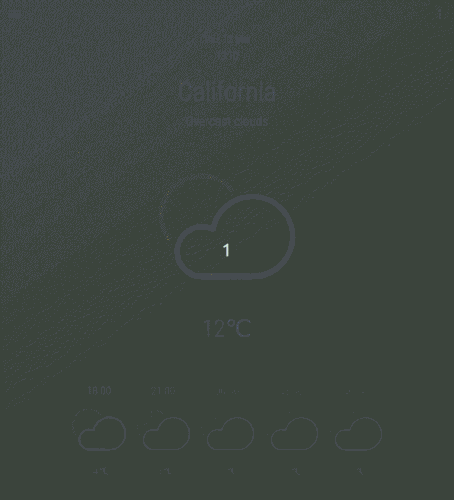

# Weather App

This project is one of the Main JavaScript curriculum projects at [Microverse](https://https://www.microverse.org/) - @microverseinc.

The [assignment](https://www.theodinproject.com/courses/javascript/lessons/weather-app) belongs to the [javascript](https://www.theodinproject.com/courses/javascript) module from [The Odin Project page](https://www.theodinproject.com/home). The objective is to create a weather forecast app using the weather API. The features of the app also include:

- Search region by name.
- Show forecast for the next hours.
- Choose between two different system for measuring heat(Fahrenheit and Celsius).

## Built With

- Javascript, HTML5 and CSS3.
- Node, Webpack and node-sass.
- Many other dependecies related to webpack configuration(loaders and plugins).

## Live Demo

[Live Demo Link](https://ssf-weather-app.herokuapp.com/)

## Preview



## Getting Started

Get a local copy cloning the repo and follow these simple steps.

### Prerequisites

- npm

### Install

```bash
npm install
```

### Usage

```bash
npm run dev
```

1. Click on the hamburguer button.

2. Type the city name in the input.

3. Click on the arrow button.

### Deployment

```bash
npm run build
```

```bash
npm start
```

## Authors

👤 **Sérgio Torres**

- Github: [Torres-ssf](https://github.com/Torres-ssf)
- Twitter: [@torres_ssf](https://twitter.com/torres_ssf)
- Linkedin: [torres-ssf](https://www.linkedin.com/in/torres-ssf/)


## 🤝 Contributing

Contributions, issues and feature requests are welcome!

Feel free to check the [issues page](https://github.com/Torres-ssf/javascript-weather-app/issues).

## Show your support

Give a ⭐️ if you like this project!


## 📝 License

This project is [MIT](./LICENSE) licensed.